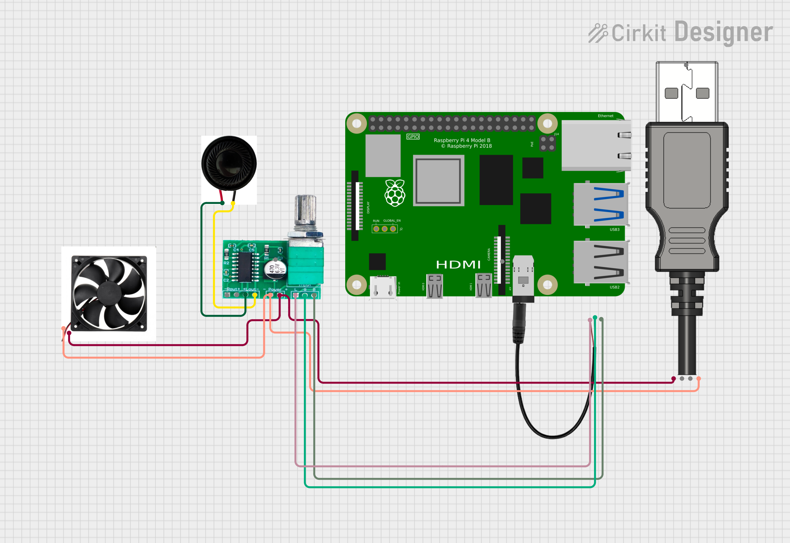

# KyraDock Development Journal

---

### May 17 — Time Spent: 3 hours

* Finalized the project idea and name: **KyraDock**, an AI-powered smart assistant dock.
* Conducted initial research on features, necessary components, and design.

---

### May 18–19 — Time Spent: 7 hours

* Designed over 5 different 3D concept models to explore potential ideas.
* Started sourcing required components such as speaker, amplifier, switches, and fan on QuartzComponents.

---

### May 20 — Time Spent: 50 mins

* Shifted component sourcing from QuartzComponents to RoboCraze due to payment gateway issues.
---

### June 10 — Time Spent: 5 hours

* Finalized the overall enclosure design and internal component layout.
* Decided not to include holes for the speaker, switch, microphone, and exhaust fan in the CAD model, opting to manually drill them later using a dremel for more flexible placement.
* Defined placement for key components:

  * [3W x2 Speakers](https://amzn.in/d/aNKvVoh) positioned near the sides of body for sound output.
  * 5V mini cooling fan mounted at the rear side for air exhaust.

* Created an initial circuit diagram mapping connections between Raspberry Pi, amplifier, fan, and other component.

---

### June 12 — Time Spent: 5 hours

* Rebuilt the KyraDock enclosure to correct dimension mismatches and improve fit for components.
* Adjusted Raspberry Pi and screen alignment to reduce extra space and made it more compact.

**Back Lid Completed** — Time Spent: 20 mins

* Created and fitted the back lid to enclose the assembly. Designed it to be detachable for future hardware modifications.

---

### June 14 — Time Spent: 1 hours

* Added additional components and finalized BOM.
* Enhanced circuit diagram.

